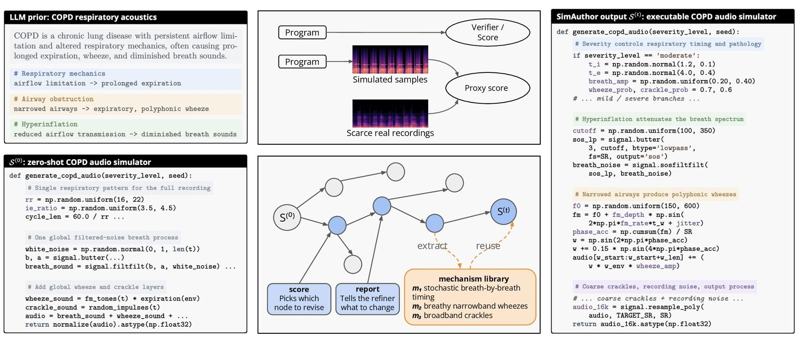

<div align="center">

# SimAuthor

**Harnessing Foundation Models for Persistent Scientific Simulator Authoring**

Yishan Wang · Ran Piao · Mathias Funk · Aaqib Saeed
<br>Eindhoven University of Technology

[](https://arxiv.org/abs/2610.06257)
[](https://yishani.github.io/SimAuthor/)
[](LICENSE)

</div>



A scientific simulator is a program that encodes how mechanisms produce an
observable signal. SimAuthor has a foundation model write such a program,
runs it, compares its output with a few dozen real recordings, and asks the
model to revise it, keeping every version in a search tree. A scalar score
decides *what* to revise, a structured discrepancy report tells the model
*how*, and edits that worked are kept as reusable mechanisms. On six
biomedical tasks (heart and lung sounds, PPG, ECG), it outperforms score-only
search on all six at a budget of 100 attempts.

**[Explore a full run on the project page →](https://yishani.github.io/SimAuthor/)**

## Install

```bash
pip install "simauthor[audio,llm] @ git+https://github.com/yishani/SimAuthor"
```

Python ≥ 3.9 and a recent pip (`pip install -U pip`). The core package needs only NumPy and SciPy; the extras add
`audio` (MFCC evaluator), `llm` (model backends and visual feedback),
`encoders` (ECGFounder, PaPaGei) and `experiments` (generalization code).
To work on the code or rerun the paper's analyses, clone the repository and
`pip install -e ".[all]"`.

## Try the released simulators

No API key or data needed:

```bash
simauthor conditions                          # the six tasks from the paper
simauthor generate AS --out samples/as        # best aortic-stenosis simulator: 100 heart-sound recordings
simauthor generate AS --which root -n 5       # the zero-shot program it started from
```

Each task ships the root program and the best program of its median-seed run
([`simauthor/simulators/`](simauthor/simulators)). They are plain Python files
you can read and edit.

## Use SimAuthor on your own problem

You need three things: a name for what to simulate, a small set of real
recordings, and an evaluator.

**1. Prepare a small reference set.** Put a few dozen real recordings in one
folder; the paper used 37–96 per task. Audio as `.wav`, ECG as `(5000, 2)`
`.npy`, PPG as `(3750,)` `.npy`.

**2. Choose or write an evaluator.** An evaluator returns a score in [0, 1]
and a short report of how generated and real recordings differ. Each signal
type has a default, used in the paper:

| Signal | Default evaluator | What it compares | Setup |
|---|---|---|---|
| Audio (heart, lung sounds) | `mfcc` | distributions of 13 MFCCs and zero-crossing rate | `pip install "simauthor[audio]"` |
| PPG | `morphology` | 10 pulse statistics such as heart rate, pulse width and rise time | none |
| ECG (leads I, II) | `ecg_founder_12lead` | embeddings from the frozen ECGFounder model | download the [ECGFounder](https://github.com/PKUDigitalHealth/ECGFounder) checkpoint and set `ECGFOUNDER_REPO`, `ECGFOUNDER_CKPT` |

The default is chosen from `--modality`; pass `--evaluator my_evaluator.py` to
use your own. Start from the [template](examples/custom_task/my_evaluator.py).

**3. Run.** SimAuthor uses Gemini 3.1 Pro by default, as in the paper
(`GEMINI_API_KEY`). Pass `--model deepseek-v4-pro` or the name of any
OpenAI-compatible model to use another backend (keys are listed in
[`.env.example`](.env.example)), or `--model mock` to test your setup offline.

```bash
export GEMINI_API_KEY=...
simauthor run --condition "Mitral regurgitation" --modality audio \
    --ref data/my_recordings --evaluator my_evaluator.py --out runs/mr
```

SimAuthor writes a scientific blueprint and a root program, then revises it
for 100 attempts. Every program, report and mechanism is saved under
`runs/mr/`, and the best program is printed at the end. The
[custom-task guide](examples/custom_task/README.md) walks through each step.

## Reproduce the paper

Every run from the paper is in [`experiments/`](experiments), organised like
the paper: the 18 main runs with all of their programs, the baselines, the
ablations, the robustness runs, the generalization experiments and the
revision audit.

```bash
python experiments/reproduce.py
```

recomputes Tables 1, 2, 3 and 5 and the revision audit from these files and
checks every value against the paper.

## Repository

```
simauthor/                the method
  initialization.py         scientific blueprint and root program
  orchestrator/             search over programs (flat PUCT)
  refiner.py                revision prompt: one focused edit per attempt
  search_feedback/          evaluators: score + discrepancy report + comparison figure
  mechanism_library.py      reusable edits
  prompts/                  all prompt templates
  simulators/               released root and best programs for the six tasks
  cli.py                    the simauthor command
experiments/              everything behind the paper's results
examples/custom_task/     template for your own task
docs/                     project page
```

## Data

No recordings are redistributed. The tasks use public research datasets under
their original licences: ZCHSound (VSD), BMD-HS (AS), ICBHI 2017 and KAUH
(COPD), MIMIC PERform AF and a long-term AF PPG set (AF), PTB-XL and
Chapman–Shaoxing–Ningbo (LQT, WPW). Recording counts and splits are listed in
the paper's appendix.

## Scope

Scores measure distributional agreement with real recordings; they do not
establish physiological or mechanistic fidelity. Nothing here is intended for
diagnostic or clinical use.

## Citation

```bibtex
@article{wang2026simauthor,
  title   = {{SimAuthor}: Harnessing Foundation Models for Persistent Scientific Simulator Authoring},
  author  = {Wang, Yishan and Piao, Ran and Funk, Mathias and Saeed, Aaqib},
  journal = {arXiv preprint arXiv:2610.06257},
  year    = {2026}
}
```

Code is released under the [MIT License](LICENSE).
